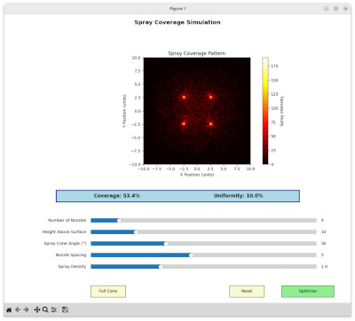

# Spray Coverage Simulation

A spray nozzle coverage analysis tool with interactive visualization.



## Overview

This application simulates spray patterns from multiple nozzles arranged in a grid pattern and provides real-time parameter adjustment through an intuitive matplotlib-based GUI. It's designed for analyzing spray coverage uniformity and optimizing nozzle configurations.

## Features

- **Interactive Parameter Control**: Real-time adjustment via sliders for all key parameters
- **Multiple Spray Patterns**: Support for different nozzle types:
  - Full Cone (uniform circular)
  - Flat Fan (elliptical - most common)
  - Hollow Cone (ring pattern)  
  - Solid Stream (concentrated)
- **Grid-Based Nozzle Arrangement**: Automatic optimal positioning of multiple nozzles
- **Coverage Metrics**: Real-time calculation of uniformity and coverage percentage
- **Professional Visualization**: Heat map display with customizable color schemes
- **Optimization Tools**: Built-in optimization functionality for parameter tuning
- **Modular Architecture**: Clean separation of simulation logic, UI, and configuration

## Installation

### Prerequisites

- Python 3.7 or higher
- Required packages:
  - numpy
  - matplotlib

### Setup

1. Clone or download the repository:
   ```bash
   git clone <repository-url>
   cd spray-coverage
   ```

2. Install dependencies:
   ```bash
   pip install numpy matplotlib
   ```

## Usage

### Running the Application

```bash
python main.py
```

### Interface Controls

The application provides several interactive controls:

- **Number of Nozzles** (1-25): Adjusts the number of spray nozzles in the grid
- **Height Above Surface** (5.0-30.0): Controls nozzle height above the target surface
- **Spray Cone Angle** (5°-80°): Sets the spray cone angle for each nozzle
- **Nozzle Spacing** (1.0-10.0): Distance between adjacent nozzles in the grid
- **Spray Density** (0.1-3.0): Multiplier for droplet density simulation

### Buttons

- **Pattern Button**: Cycles through different spray pattern types
- **Reset**: Returns all parameters to default values
- **Optimize**: Runs optimization algorithm to find optimal parameter combinations

## Configuration

Key parameters can be modified in `config.py`:


## Technical Details

### Simulation Engine

The `SpraySimulator` class in `models.py` handles:
- Multi-nozzle spray pattern generation
- Droplet trajectory calculation with gravity effects
- Grid-based coverage accumulation
- Support for different spray pattern types

### Nozzle Positioning

Nozzles are automatically arranged in an optimal grid pattern:
- Single nozzle: Positioned at center (0, 0)
- Multiple nozzles: Arranged in a square grid with proper center alignment
- Grid size calculated as `ceil(sqrt(n_nozzles))` for optimal distribution

### Coverage Metrics

The application calculates and displays:
- **Coverage Percentage**: Percentage of surface area receiving spray
- **Uniformity Index**: Measure of spray distribution evenness

## Development

### Adding New Spray Patterns

To add a new spray pattern:

1. Add the pattern to `SPRAY_PATTERNS` in `config.py`
2. Implement the pattern logic in `SpraySimulator._simulate_single_nozzle()`
3. Update the default pattern if needed

### Extending Parameters

To add new adjustable parameters:

1. Add parameter ranges to `SLIDER_RANGES` in `config.py`
2. Add slider creation in `ui.py/_create_sliders()`
3. Update simulation logic in `models.py`

## Requirements

- Python 3.7+
- NumPy: For numerical computations and array operations
- Matplotlib: For GUI and visualization components

## License

This project is provided as-is for educational and research purposes.
